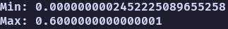

# Indexed Square Root Algorithm

- Invented by `p4lm4d3v` in `2022`

# Benchamark

- I tested this algorithm on this set of number `[4, 1000000]` and calculated the minimum difference between this algorithm and the standart `sqrt()` function implemented for the type [`f64`](https://doc.rust-lang.org/stable/std/primitive.f64.html#method.sqrt) in [`RUST`](https://www.rust-lang.org/).

&emsp;&emsp;&emsp; 

# Algorithm

I designed this algorithm in my second year of highschool when i was 16. I was bored in class and started messing with some numbers and got to this.
This algorithm is not perfectly accurate, but it was not designed to do so. It was made so I could in a fast way calculate the approximate square root of a natural non-zero number that does not have a natural root.

The algorithm works in this a way:

1. &nbsp; We first define our number `z` whose root we want to calculate following these constraints:

&emsp;&emsp;&emsp; $ \large z \, \in \, \mathbb{N} \;\; \land \;\; z \, > \, 4 $

2. &nbsp; Then we define the closest numbers that have natural roots around the number `z`:

&emsp;&emsp;&emsp; $ \large x \, < \, z \;\; \land \;\; \sqrt{x} \, \in \, \mathbb{N} \;\; ( \text{below our} \,\, z )$
   
  &emsp;&emsp;&emsp; $ \large y \, > \, z \;\; \land \;\; \sqrt{y} \, \in \, \mathbb{N} \;\; ( \text{above our} \,\, z )$

3. &nbsp; Then we generate a range from `x` to `y` not counting them:

&emsp;&emsp;&emsp; $ \large range(x, \; y) \; = \; x + 1, \; x + 2 \; ... \; x + n \; ... \; y - 2, \; y - 1 $
&emsp;&emsp;&emsp; $ \large \lor $
&emsp;&emsp;&emsp; $ \large x + 1, \; x + 2 \; ... \; y - n \; ... \; y - 2, \; y - 1 $

4. &nbsp; Then we can define `n` as the length of the `range`, then `n` from the past step is not the same `n` as in this step:

&emsp;&emsp;&emsp; $ \large n \; = \; length(range(x, \; y)) $
 
&emsp;&emsp; We can also calculate the `length` as:
 
&emsp;&emsp;&emsp; $ \large n \; = \; 2\sqrt{y} - 3$

5. &nbsp; We can now index the range with zero indexing:

&emsp;&emsp;&emsp; $ \large index(x + 1) \; = \; 0 $  
&emsp;&emsp;&emsp; $ \large index(x + 2) \; = \; 1 $  
&emsp;&emsp;&emsp; $ \large index(x + 3) \; = \; 2 $  
&emsp;&emsp;&emsp; ...  
&emsp;&emsp;&emsp; $ \large index(y - 3) \; = \; n - 3 $  
&emsp;&emsp;&emsp; $ \large index(y - 2) \; = \; n - 2 $  
&emsp;&emsp;&emsp; $ \large index(y - 1) \; = \; n - 1 $

&emsp;&emsp;&emsp; $ \large range(x, \; y) \; = \; x + 1, \; x + 2 \; ... \; x + n \; ... \; y - 2, \; y - 1 $
&emsp;&emsp;&emsp;  
&emsp;&emsp;&emsp; $ \large \text{indecies of} \; range(x, \; y) \; = \; 0, \; 1 \; ... \; n - 2, \; n - 1 $

6. &nbsp; Then using the indexed range that we made we can find the index of `z` inside the `range`:

&emsp;&emsp;&emsp; $ \large idx \; = \; \text{ index of } z \text{ in } range $

&emsp;&emsp; Simple way to do that is to substract the `first element` of the `range` from the `z` gettting the value representing where are we between `x` and `y` and we can calculate that the first element of the range is just `x + 1`:

&emsp;&emsp;&emsp; $ \large idx \; = \; z - range[0], \; range[0] \; = \; x + 1$
 
&emsp;&emsp;&emsp; $ \large idx \; = \; z - (x + 1)$
 
&emsp;&emsp;&emsp; $ \large idx \; = \; z - x - 1$

7. &nbsp; Given that we know that $ \large \sqrt{z} \; > \sqrt{x} \;\; \land \;\; \sqrt{z} \; < \sqrt{y} \;$ this implicates:

&emsp;&emsp;&emsp; $ \large \sqrt{z} \; > \sqrt{x} \;\; \land \;\; \sqrt{z} \; < \sqrt{y} \; \implies \; z \; > \; x \;\; \land \;\; z \; < \; y $

8. &nbsp; Finally knowing all of this we can derive this formula:

&emsp;&emsp;&emsp; $ \large \sqrt{z} \; \approx \; \sqrt{x} \; + \; \frac{idx}{n} $
 
&emsp;&emsp; We can simplify the formula into this form:
 
&emsp;&emsp;&emsp; $ \large \sqrt{z} \; \approx \; \sqrt{x} \; + \; \frac{z \; - \; x \; - \; 1}{2\sqrt{y} \; - \; 3} $

# Disclaimer & Conclusion

Given the requirements that the number must be above 4 roots of numbers from 0 to 4 can't be calculated.

This algorithm can be looked as a [linear interpolation](https://en.wikipedia.org/wiki/Linear_interpolation) inspired algorithm. The result for numbers between two numbers with natural roots are placed in a kinda linear stepping way, which stems from the way that we calculate the part after the decimal point by getting an index from a range array of number inbetween the two numbers with natural roots.

# Examples

1. Example 1
    
   &emsp; $ \large z \; = \; 12 $
    
   &emsp; $ \large x \; = \; 9 $
    
   &emsp; $ \large y \; = \; 16 $
    
   &emsp; $ \large \sqrt{12} \; \approx \; \sqrt{9} \; + \; \frac{12 \; - \; 9 \; - \; 1}{2\sqrt{16} \; - \; 3} $
    
   &emsp; $ \large \sqrt{12} \; \approx \; 3 \; + \; \frac{12 \; - \; 9 \; - \; 1}{2 \; \; \cdot \; 4 \; - \; 3} $
    
   &emsp; $ \large \sqrt{12} \; \approx \; 3 \; + \; \frac{12 \; - \; 9 \; - \; 1}{8 \; - \; 3} $
    
   &emsp; $ \large \sqrt{12} \; \approx \; 3 \; + \; \frac{2}{5} $
    
   &emsp; $ \large \sqrt{12} \; \approx \; 3 \; + \; 0.4 $
    
   &emsp; $ \large \sqrt{12} \; \approx \; 3.4 $

2. Example 2
    
   &emsp; $ \large z \; = \; 34 $
    
   &emsp; $ \large x \; = \; 25 $
    
   &emsp; $ \large y \; = \; 36 $
    
   &emsp; $ \large \sqrt{34} \; \approx \; \sqrt{25} \; + \; \frac{34 \; - \; 25 \; - \; 1}{2\sqrt{36} \; - \; 3} $
    
   &emsp; $ \large \sqrt{34} \; \approx \; 5 \; + \; \frac{34 \; - \; 25 \; - \; 1}{2 \; \; \cdot \; 6 \; - \; 3} $
    
   &emsp; $ \large \sqrt{34} \; \approx \; 5 \; + \; \frac{34 \; - \; 25 \; - \; 1}{12 \; - \; 3} $
    
   &emsp; $ \large \sqrt{34} \; \approx \; 5 \; + \; \frac{8}{9} $
    
   &emsp; $ \large \sqrt{34} \; \approx \; 5 \; + \; 0.8888888889 $
    
   &emsp; $ \large \sqrt{34} \; \approx \; 5.8888888889 $

3. Example 3
    
   &emsp; $ \large z \; = \; 69 $
    
   &emsp; $ \large x \; = \; 64 $
    
   &emsp; $ \large y \; = \; 81 $
    
   &emsp; $ \large \sqrt{69} \; \approx \; \sqrt{64} \; + \; \frac{69 \; - \; 64 \; - \; 1}{2\sqrt{81} \; - \; 3} $
    
   &emsp; $ \large \sqrt{69} \; \approx \; 8 \; + \; \frac{69 \; - \; 64 \; - \; 1}{2 \; \; \cdot \; 9 \; - \; 3} $
    
   &emsp; $ \large \sqrt{69} \; \approx \; 8 \; + \; \frac{69 \; - \; 64 \; - \; 1}{18 \; - \; 3} $
    
   &emsp; $ \large \sqrt{69} \; \approx \; 8 \; + \; \frac{4}{15} $
    
   &emsp; $ \large \sqrt{69} \; \approx \; 8 \; + \; 0.2666666667 $
    
   &emsp; $ \large \sqrt{69} \; \approx \; 8.2666666667 $
4. Example 4
    
   &emsp; $ \large z \; = \; 95 $
    
   &emsp; $ \large x \; = \; 81 $
    
   &emsp; $ \large y \; = \; 100 $
    
   &emsp; $ \large \sqrt{95} \; \approx \; \sqrt{81} \; + \; \frac{95 \; - \; 81 \; - \; 1}{2\sqrt{100} \; - \; 3} $
    
   &emsp; $ \large \sqrt{95} \; \approx \; 9 \; + \; \frac{95 \; - \; 81 \; - \; 1}{2 \; \; \cdot \; 10 \; - \; 3} $
    
   &emsp; $ \large \sqrt{95} \; \approx \; 9 \; + \; \frac{95 \; - \; 81 \; - \; 1}{20 \; - \; 3} $
    
   &emsp; $ \large \sqrt{95} \; \approx \; 9 \; + \; \frac{13}{17} $
    
   &emsp; $ \large \sqrt{95} \; \approx \; 9 \; + \; 0.7647058824 $
    
   &emsp; $ \large \sqrt{95} \; \approx \; 9.7647058824 $

# Implemenatation Template (add your own implementation below)

- Implemented by `[GITHUB-USERNAME]` in `[LANGUAGE]` on `[FINISHING-DATE]`
- Please make sure you add links for the username and language, and also use the `DD.MM.YYYY` date format.

# Implementations

- Implemented by [`p4lm4d3v`](https://github.com/p4lm4d3v/) in [`RUST`](https://www.rust-lang.org/) on `07.07.2024.`
